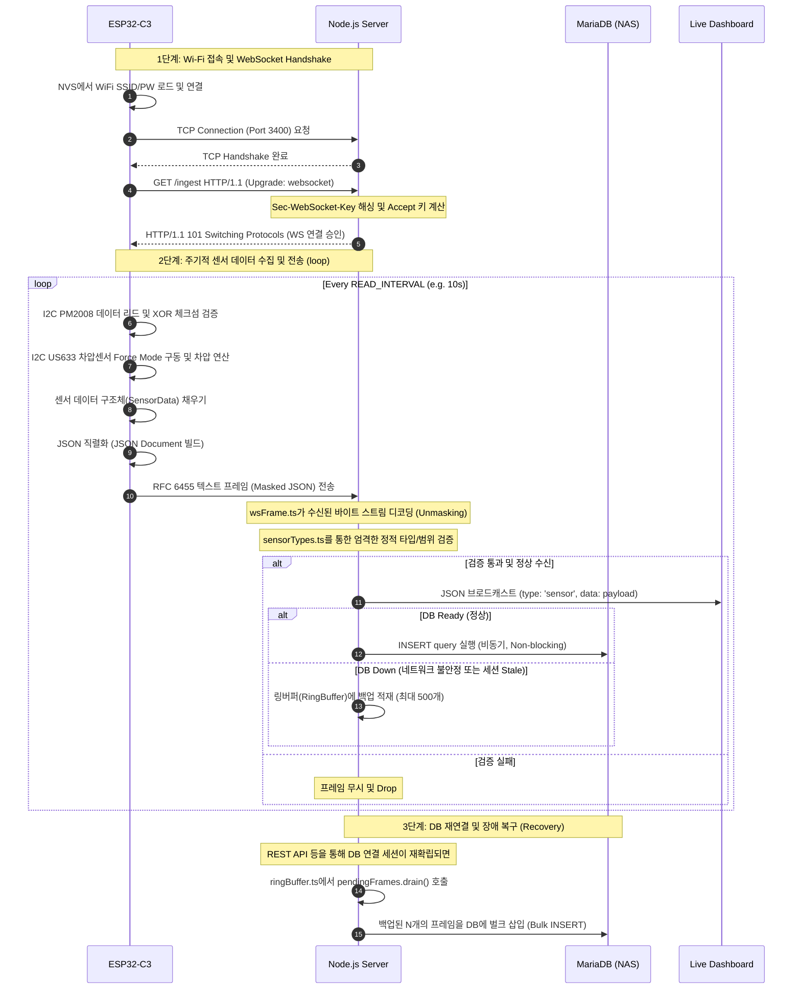

# 📡 통신 프로토콜 상세 명세서 (Communication Protocol Specification)

본 문서는 **ESP32-C3 하드웨어**에서 센서 데이터를 수집하는 과정부터, **Node.js 서버**와의 실시간 통신 및 데이터 전송을 위한 **WebSocket 프로토콜**, 그리고 데이터 무결성 검증과 장애 극복을 위한 **CRC16, RFC 6455, RingBuffer** 기술의 세부 사양 및 동작 원리를 설명합니다.

---

## 1. 시스템 아키텍처 및 데이터 흐름

### 1-1. 전체 아키텍처 구성

본 시스템은 저전력 임베디드 장치인 ESP32-C3가 센서 상태를 주기적으로 읽어, 자체 구현된 가벼운 TCP/WebSocket 서버에 전송하고, 서버가 이를 실시간 대시보드 클라이언트들에게 중계(Broadcast)함과 동시에 영속 데이터베이스(MariaDB)에 보관하는 실시간 모니터링 시스템입니다.

```
┌────────────────────────────────────────┐
│               ESP32-C3                 │ (I2C Master)
└──────────────────┬─────────────────────┘
                   │
         I2C Bus   ├─► [PM2008 센서] (0x28) 32바이트 프레임, XOR 체크섬
                   └─► [US633 차압센서] (0x4F) Force Mode, 24비트 정밀 차압
                   │
                   ▼ (Wi-Fi)
┌────────────────────────────────────────┐
│            Node.js TS 서버             │ (Port: 3400)
│   - 단일 TCP 리스너 기반 HTTP/WS 다중화   │
│   - RFC 6455 웹소켓 프레임 디코더 내장   │
└──────────┬───────────────────┬─────────┘
           │                   │
           │ DB 정상 연결 시     │ DB 장애 / 미연결 시
           ▼                   ▼
┌──────────────────┐    ┌──────────────┐
│  MariaDB (NAS)   │    │  RingBuffer  │ (최대 500개 백업)
│  (Port: 3306)    │    │ (Memory-safe)│ ➔ DB 복구 시 일괄 batch insert
└──────────────────┘    └──────────────┘
           ▲
           │ SELECT
┌──────────┴───────┐
│     Grafana      │
│  (대시보드 시각화) │
└──────────────────┘
```

### 1-2. 워크플로우 시퀀스 다이어그램



---

## 2. 물리/장치 계층: I2C 센서 통신 프로토콜

### 2-1. PM2008 미세먼지 센서 (JSD-BH-312-002)
PM2008 센서는 I2C 버스의 **Slave Address `0x28`**을 사용하며, 단일 측정 프레임의 크기는 **32바이트** 고정 크기입니다.

* **통신 시작 명령 (Setup Continuous Measurement)**:
  `0x16, 0x07, 0x03, 0xFF, 0xFF, 0x00, 0x12`
  마지막 바이트인 `0x12`는 앞선 6개 바이트의 XOR 체크섬입니다 (`0x16^0x07^0x03^0xFF^0xFF^0x00 = 0x12`).

* **32바이트 데이터 수신 및 구조**:

| 바이트 번호 | 필드 정의 | 자료형 | 설명 |
| :---: | :--- | :---: | :--- |
| `0` | Header | `uint8_t` | 고정값 `0x16` (동기화 프레임 헤더) |
| `1` | Frame Length | `uint8_t` | 프레임 총 크기인 `0x20` (10진수 32) |
| `2` | Sensor Status | `uint8_t` | 센서 내부 상태 (Stable, Testing, Alarm, Close 등) |
| `3 ~ 6` | Reserved | - | 사용되지 않음 |
| `7, 8` | PM1.0 GRIMM | `uint16_t` | Grimm 규격 PM1.0 농도 (Big-Endian) |
| `9, 10` | PM2.5 GRIMM | `uint16_t` | Grimm 규격 PM2.5 농도 (Big-Endian) |
| `11, 12` | PM10 GRIMM | `uint16_t` | Grimm 규격 PM10 농도 (Big-Endian) |
| `13, 14` | PM1.0 TSI | `uint16_t` | TSI 규격 PM1.0 농도 (Big-Endian) |
| `15, 16` | PM2.5 TSI | `uint16_t` | TSI 규격 PM2.5 농도 (Big-Endian) |
| `17, 18` | PM10 TSI | `uint16_t` | TSI 규격 PM10 농도 (Big-Endian) |
| `19 ~ 30` | 개수 농도 (cnt_X) | `uint16_t[]` | 0.3㎛, 0.5㎛, 1.0㎛, 2.5㎛, 5.0㎛, 10㎛ 입자 개수 |
| `31` | Checksum (XCS) | `uint8_t` | `buf[0] ~ buf[30]`까지의 XOR 연산 누적 값 |

* **데이터 가공 방식**:
  아두이노 I2C 버퍼에서 2바이트씩 분산되어 오는 데이터를 하나의 16비트 정수로 정렬하기 위해, 상위 바이트(MSB)를 8비트 시프트 한 후 하위 바이트(LSB)를 비트 OR 연산으로 합성합니다.
  $$\text{Value} = (\text{buf}[\text{MSB\_Index}] \ll 8) \mid \text{buf}[\text{LSB\_Index}]$$

* **검증 (XOR Checksum)**:
  ```cpp
  uint8_t xcs = 0;
  for (int i = 0; i < 31; i++) xcs ^= buf[i];
  if (xcs != buf[31]) {
      // 체크섬 불일치 시 쓰레기 데이터로 판단하고 프레임 버림
  }
  ```

### 2-2. US633-F1K-T4 차압 센서
차압 센서는 I2C 버스의 **Slave Address `0x4F`**를 사용합니다. 상시 측정 모드(Continuous Mode)를 돌릴 시 센서 발열로 인해 압력 정밀도가 떨어지므로, 본 프로그램은 매 주기마다 일회성 측정을 명령하는 **Force Mode**로 작동합니다.

1. **측정 트리거**: ESP32가 센서에 1바이트 명령 `PRESSURE_CMD_FORCE`(`0xAC`)를 전송합니다.
2. **변환 대기**: 센서 내부 정전 용량 스캔 및 ADC 연산 시간을 위해 최소 10ms 대기(`delay(10)`)를 수행합니다.
3. **데이터 수신**: 센서로부터 4바이트 프레임 `[Status, Pressure_Hi, Pressure_Mid, Pressure_Lo]`를 읽어 들입니다.
4. **차압(Pressure in Pa) 연산 공식**:
   - 수신된 하위 3바이트를 조합하여 24비트 무부호 정수 `raw24`를 생성합니다:
     $$\text{raw24} = (\text{Hi} \ll 16) \mid (\text{Mid} \ll 8) \mid \text{Lo}$$
   - 데이터시트 기준 차압 센서의 0점(Zero-point offset)은 $0\text{x}800000$ (중앙값 $8,388,608$)입니다. 입력 압력이 음수(-)일 수도 있으므로 `raw24`에서 중앙값을 감산하여 부호 있는 편차(`centered`)를 구합니다.
     $$\text{centered} = \text{raw24} - 0\text{x}800000$$
   - 차압 변환 스케일 식에 따라 다음과 같이 계산하며, 곱셈 연산 시 임시 값이 $1.6 \times 10^{10}$까지 도달하므로 32비트 변수의 오버플로우를 막기 위해 반드시 **64비트 정수 연산(`int64_t`, `LL` 리터럴)**을 사용해야 합니다.
     $$\text{Pa} = \frac{\text{centered} \times 2000}{11,744,051}$$
   - 최종 연산된 64비트 값을 `int32_t`로 캐스팅하여 정밀 차압 값을 복원합니다.

---

## 3. 네트워크 계층: 웹소켓(WebSocket) 프로토콜

### 3-1. 웹소켓(WebSocket)이란?
웹소켓(WebSocket)은 단일 TCP 커넥션을 통해 전이중(Full-Duplex) 통신 채널을 제공하는 컴퓨터 통신 프로토콜입니다. 
웹 브라우저 및 클라이언트와 웹 서버 간의 양방향 메시지 교환을 최적화하기 위해 설계되었으며, 기본적으로 HTTP 80/443 포트 위에서 작동하므로 방화벽 프록시 및 기존 인프라를 그대로 공유할 수 있습니다.

### 3-2. 왜 웹소켓을 쓰는 것이 더 좋은가? (HTTP vs WebSocket)

```
[HTTP 단방향 요청/응답 구조]
Client  ───────────────── Request (Headers: 500B ~ 1KB) ─────────────────►  Server
Client  ◄──────────────── Response (Headers + JSON body) ────────────────  Server
※ 매 주기마다 TCP Handshake를 맺거나(Non-keepalive), 무거운 HTTP 헤더를 매번 주고받음.

[WebSocket 양방향 지속 커넥션 구조]
Client  ── HTTP Upgrade Handshake ──► Server  (최초 1회만 수행)
Client  ◄── Upgrade HTTP 101 Accept ── Server
Client  ◄======================= TCP Connection 유지 =======================► Server
Client  ── Frame Header (2~14B) + JSON ──► Server  (매 10초마다 극소량 오버헤드로 전송)
```

1. **오버헤드 최소화**: 
   HTTP 요청은 매번 수백 바이트에서 수 킬로바이트의 헤더(User-Agent, Cookie, Accept 등)를 포함하여 보냅니다. 반면 웹소켓 프레임은 기본 헤더 크기가 단 **2~10바이트**에 불과하여 네트워크 대역폭 소비를 비약적으로 줄입니다.
2. **실시간 양방향 통신**:
   기존 HTTP는 클라이언트가 물어봐야만 서버가 답을 주는 단방향 구조(Request-Response)입니다. 미세먼지나 차압 같은 동적 센서 데이터를 모니터링하기 위해 HTTP 폴링(Polling)을 쓰면 불필요한 요청이 낭비되지만, 웹소켓은 ESP32가 데이터를 쏘는 즉시 서버가 대시보드로 Push할 수 있어 지연 시간(Latency)이 거의 존재하지 않습니다.
3. **커넥션 유지 비용 절감**:
   기본 TCP 3-way handshake 과정을 연결 설정 시 최초 1회만 거치므로, 빈번한 소켓 생성/폐기로 인한 OS 리소스(Ephemeral Port 고갈 등) 낭비를 방지합니다.

### 3-3. WebSocket vs MQTT 프로토콜 비교

| 비교 항목 | WebSocket (RFC 6455) | MQTT (Message Queuing Telemetry Transport) |
| :--- | :--- | :--- |
| **토폴로지** | **Client - Server (1:1 직결)** | **Publish - Subscribe (Broker 중계 구조)** |
| **중계 장치** | 불필요 (서버 애플리케이션이 소켓 직접 관리) | **필요 (MQTT Broker: Mosquitto, EMQX 등)** |
| **프로토콜 오버헤드** | 헤더 2 ~ 14 바이트 | 헤더 2 바이트 (매우 가벼움) |
| **전송 계층** | TCP | TCP / TLS |
| **웹 브라우저 지원** | **네이티브 지원 (JS API 기본 제공)** | 직접 지원 불가 (WS 위에서 MQTT over WS로 구동해야 함) |
| **주 사용처** | 웹 실시간 서비스, 양방향 직결 서비스 | 대규모 IoT 센서 디바이스 망, 일대다 브로드캐스트 |

#### 💡 본 프로젝트에서 웹소켓을 채택한 배경
1. **중간 구조 단일화**: MQTT를 사용하려면 별도의 MQTT 브로커(Broker) 컨테이너나 패키지를 서버 PC에 설치하고 운영해야 합니다. 반면 웹소켓을 채택하면 Node.js 단일 프로세스가 TCP 소켓 포트 하나로 **ESP32 수집 API**와 **웹 프론트엔드 대시보드 API**를 모두 통제하므로 시스템 복잡도가 극적으로 감소합니다.
2. **웹 대시보드와의 네이티브 호환성**: 브라우저는 기본적으로 일반 TCP 소켓이나 순수 MQTT 소켓을 열 수 없습니다. 브라우저가 제공하는 표준 `WebSocket` API를 활용해 서버와 브라우저를 직결하는 구조이므로 추가 래퍼나 게이트웨이가 필요 없어 저지연 직결 아키텍처에 가장 유리합니다.
3. **가공 및 영속화 제어**: 센서 날것의 JSON 데이터를 DB에 집어넣는 비즈니스 로직을 Node.js 서버가 직접 처리하므로, MQTT 브로커를 거쳐 다시 백엔드가 구독하는 형태의 다중 홉(Multi-hop) 경로를 거치지 않고 소켓 이벤트를 통해 즉시 파싱-검증-DB 삽입 단계를 밟을 수 있습니다.

---

## 4. RFC 6455 웹소켓 상세 사양 및 직접 구현

### 4-1. 웹소켓 핸드셰이크(Handshake) 프로토콜
웹소켓 통신을 시작하기 위해 클라이언트는 HTTP Get 요청을 보내며 헤더에 **Upgrade** 필드를 설정합니다.

* **Client Handshake Request**:
  ```http
  GET /ingest HTTP/1.1
  Host: 192.168.0.126:3400
  Upgrade: websocket
  Connection: Upgrade
  Sec-WebSocket-Key: dGhlIHNhbXBsZSBub25jZQ==
  Sec-WebSocket-Version: 13
  ```

* **Server Handshake Response**:
  서버는 클라이언트가 보낸 `Sec-WebSocket-Key` 값 뒤에 마법의 전역 고유 식별자(GUID) **`258EAFA5-E914-47DA-95CA-C5AB0DC85B11`** 문자열을 결합합니다. 결합된 문자열을 **SHA-1** 알고리즘으로 해싱한 뒤, 그 바이너리 값을 **Base64**로 인코딩하여 응답 헤더의 `Sec-WebSocket-Accept` 필드에 담아 보냅니다.
  $$\text{AcceptKey} = \text{Base64}(\text{SHA1}(\text{Sec-WebSocket-Key} + \text{"258EAFA5-E914-47DA-95CA-C5AB0DC85B11"}))$$
  
  ```http
  HTTP/1.1 101 Switching Protocols
  Upgrade: websocket
  Connection: Upgrade
  Sec-WebSocket-Accept: s3pPLMBiTxaQ9kYGzzhZRbK+xOo=
  ```
  이 핸드셰이크가 성공하면 기존 HTTP 규약은 종료되고, 동일 TCP 소켓 위에서 RFC 6455 프레임 규격의 바이너리 통신이 시작됩니다.

### 4-2. RFC 6455 데이터 프레임 구조
핸드셰이크 이후 모든 데이터는 아래 포맷의 바이너리 프레임 단위로 쪼개져 전송됩니다.

```
 0                   1                   2                   3
 0 1 2 3 4 5 6 7 8 9 0 1 2 3 4 5 6 7 8 9 0 1 2 3 4 5 6 7 8 9 0 1
+-+-+-+-+-------+-+-------------+-------------------------------+
|F|R|R|R| opcode|M|     Payload |    Extended payload length    |
|I|S|S|S|  (4b) |A|     len (7b)|             (16/64)           |
|N|V|V|V|       |S|             |   (if payload len==126/127)   |
| |1|2|3|       |K|             |                               |
+-+-+-+-+-------+-+-------------+ - - - - - - - - - - - - - - - +
|     Extended payload length continued, if payload len == 127  |
+-------------------------------+-------------------------------+
|                               |Masking-key, if MASK set to 1  |
+-------------------------------+-------------------------------+
| Masking-key (continued)       |          Payload Data         |
+-------------------------------- - - - - - - - - - - - - - - - +
:                     Payload Data continued ...                :
+---------------------------------------------------------------+
```

* **FIN (1 bit)**: 이 프레임이 메시지의 마지막 조각인지 여부를 뜻합니다. 단일 프레임 전송 시 `1`로 설정됩니다.
* **Opcode (4 bits)**: 프레임 데이터의 성격을 나타냅니다.
  - `0x00`: Continuation Frame (단편화 프레임)
  - `0x01`: Text Frame (UTF-8 텍스트)
  - `0x02`: Binary Frame (바이너리 raw 데이터)
  - `0x08`: Connection Close (연결 종료 요청)
  - `0x09`: Ping
  - `0x0A`: Pong
* **MASK (1 bit)**: 데이터 페이로드가 마스킹(난독화)되어 전송되는지 여부입니다. **RFC 6455 표준에 따라 클라이언트가 서버로 보내는 모든 프레임은 무조건 MASK 필드가 `1`이어야 하며 4바이트 마스킹 키가 동반되어야 합니다.** 서버가 이를 위반한 프레임을 받으면 즉시 연결을 강제 종료해야 합니다. (반대로 서버가 클라이언트에 전송할 때는 MASK를 `0`으로 비우고 마스킹 키 없이 보냅니다.)
* **Payload Length (7 bits, 7+16 bits, 7+64 bits)**:
  - 실제 데이터 바이트 수 크기가 **125 바이트 이하**일 경우: 7비트 필드 자체가 데이터 길이가 됩니다.
  - 크기가 **126 ~ 65,535 바이트**일 경우: 7비트 필드 값을 `126`(`0x7E`)으로 설정하고, 바로 뒤따라오는 2바이트(16비트 무부호 정수)에 실제 데이터 크기를 명시합니다.
  - 크기가 **65,536 바이트 이상**일 경우: 7비트 필드 값을 `127`(`0x7F`)로 설정하고, 뒤따라오는 8바이트(64비트 정수)에 실제 크기를 명시합니다.

### 4-3. 프로그램 내 직접 구현 분석 ([wsFrame.ts](file:///home/hajun/dev_ws/esp32-nodejs-websocket/server/wsFrame.ts))
이 프로젝트는 외부 의존 라이브러리(ws, express 등) 없이 TCP 소켓의 바이트 스트림을 수신해 직접 프레임을 디코딩합니다.

#### 1. 디코딩 및 Unmasking 알고리즘 (`decodeFrames` 함수)
* 수신된 `buf` 바이트가 불완전한 상태(TCP 단편화)로 들어올 경우를 대비해, 헤더 길이를 판별한 후 데이터가 덜 왔으면 루프를 깨고 버퍼에 대기(`remainder` 반환)시킵니다.
* 마스킹 해제 공식:
  클라이언트로부터 전달받은 `MASK` 키가 활성화되어 있으면, 서버는 4바이트로 구성된 `mask` 버퍼를 읽고, 실제 페이로드 데이터 각각의 인덱스 `i`에 대해 **XOR 연산**을 수행하여 본래의 데이터를 복원합니다.
  $$\text{Payload}[i] = \text{RawData}[\text{Offset} + i] \oplus \text{Mask}[i \pmod 4]$$
  ```typescript
  // wsFrame.ts L64-67
  const payload = Buffer.alloc(plen);
  for (let i = 0; i < plen; i++) {
      payload[i] = mask ? cur[off + i] ^ mask[i & 3] : cur[off + i];
  }
  ```
  `i & 3`은 `i % 4` 연산과 완전히 동일하지만, 비트 연산자를 사용하여 연산 속도가 더욱 빠릅니다.

#### 2. 인코딩 및 프레임 전송 (`sendFrame` 함수)
서버가 클라이언트에게 데이터를 발송할 때는 마스킹을 지정하지 않으므로 헤더 구조가 비교적 간단합니다. `sendFrame` 함수는 전송하려는 페이로드 크기(`len`)에 맞춰 헤더를 빌드하고 데이터를 결합해 소켓에 직접 씁니다.
```typescript
// wsFrame.ts L76-95 (서버 -> 클라이언트 전송용 프레임 구성)
const len = payload.length;
const finOp = 0x80 | opcode; // FIN = 1 설정
let header: Buffer;
if (len < 126) {
    header = Buffer.from([finOp, len]);
} else if (len < 65536) {
    header = Buffer.alloc(4);
    header[0] = finOp;
    header[1] = 126;
    header.writeUInt16BE(len, 2);
} else {
    header = Buffer.alloc(10);
    header[0] = finOp;
    header[1] = 127;
    header.writeBigUInt64BE(BigInt(len), 2);
}
socket.write(Buffer.concat([header, payload]));
```

### 4-4. Ingest 데이터 스펙 (JSON)
ESP32가 `/ingest` 웹소켓 커넥션에 실어보내는 텍스트 프레임 본문은 아래와 같은 JSON 데이터 형태를 띱니다.

```json
{
  "pm1_grimm": 12,
  "pm25_grimm": 24,
  "pm10_grimm": 30,
  "pm1_tsi": 10,
  "pm25_tsi": 20,
  "pm10_tsi": 25,
  "cnt_0p3": 3500,
  "cnt_0p5": 920,
  "cnt_1p0": 180,
  "cnt_2p5": 45,
  "cnt_5p0": 12,
  "cnt_10": 2,
  "pressure_pa": 124,
  "pressure_status": 0
}
```

* **Ingest 데이터 수신 검증 로직 ([sensorTypes.ts](file:///home/hajun/dev_ws/esp32-nodejs-websocket/server/sensorTypes.ts))**:
  - 미세먼지 수치 12종 (`pmX_grimm`, `pmX_tsi`, `cnt_X` 등)은 반드시 `0 ~ 65535` 범위에 해당하는 양의 정수(`uint16_t`)여야 합니다. 소수점을 포함하거나 범위를 벗어난 이상 데이터는 로그를 남기고 즉시 드롭합니다.
  - 차압 수치(`pressure_pa`)는 센서 측정 오류나 케이블 결선 불량 시 `null`을 반환하므로, `null` 값 입력을 허용하되 실수 형태로 수집된 경우에는 반올림 연산(`Math.round`)을 수행하여 DB의 `SMALLINT` 범위(`-32768 ~ 32767`) 내로 정제합니다.

---

## 5. 핵심 이론 및 복구 알고리즘

### 5-1. CRC16 (Cyclic Redundancy Check)

#### 1. 정의 및 동작 원리
**순환 중복 검사(CRC, Cyclic Redundancy Check)**는 디지털 데이터 전송 중 발생하는 물리적인 노이즈나 비트 반전 오류 등을 검출하기 위해 널리 사용되는 대수적 코드 검증 기법입니다.

데이터 비트열 전체를 하나의 커다란 '이진 다항식'으로 취급하며, 사전에 규정된 특정 고정 다항식(생성 다항식, Generator Polynomial)으로 나눗셈 연산을 수행합니다. 이때 이진 연산 체계(Modulo-2 arithmetic, 캐리가 없는 덧셈/뺄셈 연산으로 실질적으로 XOR와 동일함) 하에 나눗셈을 실행하여 도출된 **나머지(Remainder) 값**을 송신 데이터 뒤에 덧붙여서 보냅니다. 수신자는 동일한 생성 다항식으로 전체 프레임을 나누었을 때 나머지가 `0`으로 떨어지는지 확인하여 에러 여부를 판별합니다.

```
[송신측 연산 구조]
   Data Stream (M) ➔ 시프트 연산 ➔ [Modulo-2 division (나눗셈)]
                                                │
                                                ▼ (나머지 도출)
   Data Stream + 16비트 CRC 값(Remainder) 형태로 송신 버스에 인가

[수신측 연산 구조]
   Received Frame  ➔ [Modulo-2 division] ➔ Remainder가 0이면 OK, 0이 아니면 에러 감지
```

#### 2. 대표적인 생성 다항식 규격
16비트 크기의 오류 검출 코드를 생성하는 CRC16은 주로 산업용 필드버스, Modbus 등에서 에러 검출의 표준으로 활용됩니다.
- **CRC-16-IBM (Modbus)**: $x^{16} + x^{15} + x^2 + 1$ (다항식 값: `0x8005`)
- **CRC-16-CCITT**: $x^{16} + x^{12} + x^5 + 1$ (다항식 값: `0x1021`)

#### 3. 프로젝트 내 XOR 체크섬과의 비교
현재 아두이노 PM2008 센서가 사용하는 **단순 XOR 체크섬(XCS)**은 구현이 직관적이며 연산 속도가 빠르지만 치명적인 한계점을 안고 있습니다.
* **XOR 체크섬의 한계**: 두 개 이상의 서로 다른 비트 위치가 동시에 반전(이중 오류)되거나, 데이터 바이트의 순서가 뒤바뀌는 에러(예: 수신 버퍼에서 `0x01, 0x05`가 순서 오류로 `0x05, 0x01`이 된 경우)를 연산 구조상 전혀 감지할 수 없습니다. 
* **CRC16의 우수성**: 다항식 나눗셈 구조를 사용하므로 데이터 내 임의의 비트들이 연속적으로 뭉쳐서 깨지는 **버스트 에러(Burst Error)**를 거의 100% 잡아낼 수 있으며, 단일 비트나 다중 비트 전송 손실에 대해서도 수학적으로 매우 정밀한 신뢰성을 제공합니다.

---

### 5-2. RingBuffer (링 버퍼)

#### 1. 정의 및 동작 원리
**링 버퍼(Ring Buffer, 원형 큐)**는 메모리 공간의 처음과 끝이 연결된 것처럼 순환하도록 설계하여, 정해진 크기의 버퍼 공간을 반복적으로 재사용하는 고정 메모리 데이터 구조입니다.

```
       [ 0 ] ➔ [ 1 ] ➔ [ 2 ]
         ▲               │
         │               ▼
       [ 5 ]           [ 3 ]
         ▲               │
         │               ▼
       [ 4 ] ◄───────────┘
   (Head와 Tail 인덱스가 Modulo 연산으로 회전)
```

선형 배열 구조에서는 큐에서 데이터가 빠져나갈 때마다 남은 항목들을 앞으로 당기는 연산(Shift) 작업이 필요해 대량의 오버헤드가 발생하지만, 링 버퍼는 오직 **두 개의 포인터(Write 포인터인 Head, Read 포인터인 Tail)**만을 조절하여 무조건 $O(1)$ 상수 시간 내에 데이터를 삽입/삭제할 수 있는 메모리 효율적인 구조를 가집니다.

* **동작 상세**: 
  버퍼의 용량 한계치(`capacity`)를 넘어선 새로운 데이터가 들어오면, 가장 오래전에 저장되었던 영역의 메모리 포인터로 되돌아가 기존의 오래된 레코드를 지우고 그 자리에 덮어쓰는(Overwrite / Silent Drop) 구조를 갖춥니다.

#### 2. 본 프로젝트 내에서의 장애 극복 역할 ([ringBuffer.ts](file:///home/hajun/dev_ws/esp32-nodejs-websocket/server/ringBuffer.ts))
임베디드 수집 환경에서는 DB가 설치된 NAS 장치가 꺼지거나, 공유기 전원이 내려가 네트워크 세션이 유실(Stale Connection)되는 장애 상황이 발생할 수 있습니다. 

* **메모리 보호 및 누수 방지**:
  서버 측에 DB 장애가 터졌을 때, ESP32가 매 10초마다 날리는 실시간 프레임을 무제한으로 일반 배열에 쌓는다면 V8 엔진의 메모리가 점진적으로 누수되어 최종적으로 **OOM(Out Of Memory)** 크래시가 발생해 백엔드 서버 자체가 뻗어버릴 위험이 큽니다.
  이를 극복하기 위해 최대 용량이 **`500`**으로 엄격히 상한 제한된 `RingBuffer` 인스턴스를 메모리 상에 배정합니다.
  ```typescript
  // ringBuffer.ts L14-35
  class RingBuffer<T> {
      private data: T[] = [];
      constructor(private readonly cap: number) {}

      push(x: T): void {
          this.data.push(x);
          if (this.data.length > this.cap) {
              // 크기 초과 시 가장 오래된 인덱스 0번 항목부터 소리 없이 제거 (Silent Drop)
              this.data.splice(0, this.data.length - this.cap);
          }
      }
      ...
  }
  export const pendingFrames = new RingBuffer<BufferedFrame>(500);
  ```
  이로 인해 유실 가능한 센서 로그의 수집 연속성은 보존하면서도 메모리 점유율을 일정 크기 이하로 타이트하게 제한할 수 있어 서버 생존성을 확보합니다.

* **DB 복구 시 일괄 적재 (Drain & Batch Flush)**:
  웹 대시보드 조작이나 주기적인 헬스 체크 등에 의해 백엔드 서버가 DB 연결을 재수립(`db.isReady() === true`)하는 데 성공하면, 밀려있던 버퍼를 순서대로 한 번에 비워냅니다.
  ```typescript
  // ringBuffer.ts L25-29
  drain(): T[] {
      const r = this.data;
      this.data = []; // 버퍼 공간 초기화
      return r;
  }
  ```
  `drain()` 메소드로 비워진 대량의 센서 프레임 배열은 Node.js 서버에 의해 **벌크 삽입(Bulk Insert) 쿼리**로 변환되어 DB에 적재되며, 데이터 공백기 없이 시각화 그래프 상의 공백을 채우는 복구 로직이 매끄럽게 완성됩니다.
